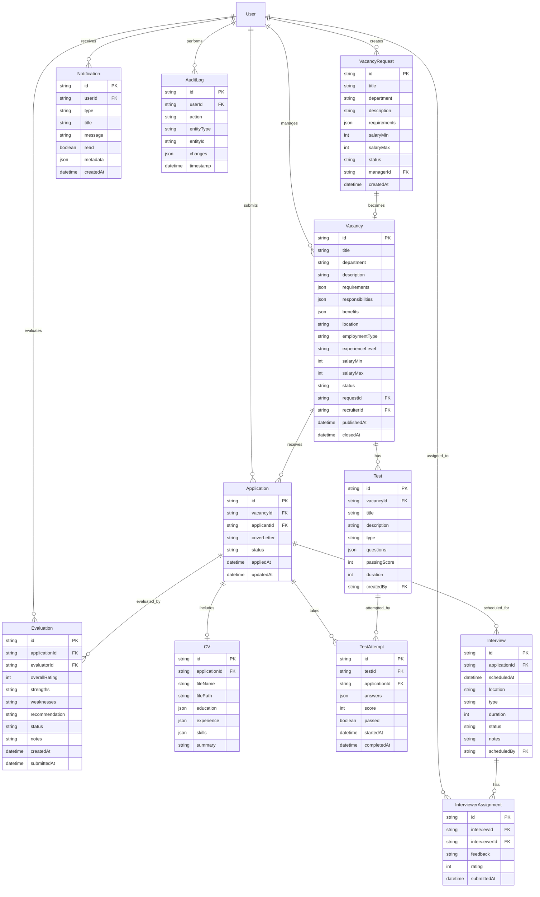

# Entity Relationship Diagram

## Database Schema Overview

This document describes the database schema for the Recruitment Management System using an Entity-Relationship Diagram (ERD).

## ERD Diagram (Mermaid)

## Entity Descriptions

### User
**Purpose**: Stores all system users with different roles

**Key Attributes**:
- `id`: Unique identifier
- `email`: User's email (unique)
- `password`: Hashed password
- `role`: User role (APPLICANT, RECRUITER, MANAGER, INTERVIEWER, ADMIN)
- `firstName`, `lastName`: User's name
- `department`: Department (for managers)

**Relationships**:
- Creates VacancyRequests (Manager)
- Manages Vacancies (Recruiter)
- Submits Applications (Applicant)
- Evaluates Applications (Interviewer)
- Receives Notifications (All)

---

### VacancyRequest
**Purpose**: Stores vacancy requests created by managers

**Key Attributes**:
- `id`: Unique identifier
- `title`: Job title
- `department`: Department name
- `description`: Job description
- `requirements`: Required qualifications (JSON array)
- `salaryMin`, `salaryMax`: Salary range
- `status`: PENDING, APPROVED, DECLINED

**Relationships**:
- Created by Manager (User)
- Becomes Vacancy when approved

---

### Vacancy
**Purpose**: Stores published job vacancies

**Key Attributes**:
- `id`: Unique identifier
- `title`: Job title
- `department`: Department
- `description`: Full job description
- `requirements`: Required qualifications (JSON)
- `responsibilities`: Job responsibilities (JSON)
- `benefits`: Company benefits (JSON)
- `employmentType`: FULL_TIME, PART_TIME, CONTRACT, INTERNSHIP
- `experienceLevel`: ENTRY, JUNIOR, MID, SENIOR, LEAD, EXECUTIVE
- `status`: DRAFT, PUBLISHED, CLOSED

**Relationships**:
- Created from VacancyRequest
- Managed by Recruiter (User)
- Receives Applications
- Has Tests

---

### Application
**Purpose**: Stores job applications from applicants

**Key Attributes**:
- `id`: Unique identifier
- `vacancyId`: Reference to Vacancy
- `applicantId`: Reference to User (Applicant)
- `coverLetter`: Application cover letter
- `status`: Application status (APPLIED, SCREENING, TEST_INVITED, etc.)
- `appliedAt`: Application submission date

**Relationships**:
- Submitted by Applicant (User)
- For Vacancy
- Includes CV
- Has TestAttempts
- Has Interviews
- Has Evaluations

---

### CV
**Purpose**: Stores applicant CV data (file and structured data)

**Key Attributes**:
- `id`: Unique identifier
- `applicationId`: Reference to Application
- `fileName`: Original file name
- `filePath`: Storage path
- `education`: Education history (JSON array)
- `experience`: Work experience (JSON array)
- `skills`: Skills list (JSON array)
- `summary`: Professional summary

**Relationships**:
- Belongs to Application

---

### Test
**Purpose**: Stores tests created for vacancies

**Key Attributes**:
- `id`: Unique identifier
- `vacancyId`: Reference to Vacancy
- `title`: Test title
- `type`: QUIZ or CODING
- `questions`: Test questions (JSON array)
- `passingScore`: Minimum score to pass
- `duration`: Time limit in minutes

**Relationships**:
- Belongs to Vacancy
- Created by Recruiter (User)
- Has TestAttempts

---

### TestAttempt
**Purpose**: Stores applicant test submissions

**Key Attributes**:
- `id`: Unique identifier
- `testId`: Reference to Test
- `applicationId`: Reference to Application
- `answers`: Submitted answers (JSON)
- `score`: Calculated score
- `passed`: Whether applicant passed
- `completedAt`: Submission timestamp

**Relationships**:
- For Test
- By Application

---

### Interview
**Purpose**: Stores scheduled interviews

**Key Attributes**:
- `id`: Unique identifier
- `applicationId`: Reference to Application
- `scheduledAt`: Interview date and time
- `location`: Physical address or video link
- `type`: PHONE, VIDEO, IN_PERSON
- `status`: SCHEDULED, COMPLETED, CANCELLED
- `duration`: Duration in minutes

**Relationships**:
- For Application
- Scheduled by Recruiter (User)
- Has InterviewerAssignments

---

### InterviewerAssignment
**Purpose**: Stores interviewer assignments and feedback

**Key Attributes**:
- `id`: Unique identifier
- `interviewId`: Reference to Interview
- `interviewerId`: Reference to User (Interviewer)
- `feedback`: Interview feedback text
- `rating`: Rating (1-5)
- `submittedAt`: Feedback submission time

**Relationships**:
- For Interview
- By Interviewer (User)

---

### Evaluation
**Purpose**: Stores candidate evaluations

**Key Attributes**:
- `id`: Unique identifier
- `applicationId`: Reference to Application
- `evaluatorId`: Reference to User (Interviewer/Manager)
- `overallRating`: Overall rating (1-5)
- `strengths`: Candidate strengths
- `weaknesses`: Areas for improvement
- `recommendation`: STRONGLY_RECOMMEND, RECOMMEND, NEUTRAL, NOT_RECOMMEND
- `status`: PENDING, IN_PROGRESS, COMPLETED

**Relationships**:
- For Application
- By Evaluator (User)

---

### Notification
**Purpose**: Stores user notifications

**Key Attributes**:
- `id`: Unique identifier
- `userId`: Reference to User
- `type`: Notification type
- `title`: Notification title
- `message`: Notification message
- `read`: Read status
- `metadata`: Additional data (JSON)

**Relationships**:
- Sent to User

---

### AuditLog
**Purpose**: Stores audit trail of all system actions

**Key Attributes**:
- `id`: Unique identifier
- `userId`: Reference to User who performed action
- `action`: Action type (CREATE, UPDATE, DELETE)
- `entityType`: Type of entity affected
- `entityId`: ID of affected entity
- `changes`: What changed (JSON)
- `timestamp`: When action occurred

**Relationships**:
- Performed by User

---

## Cardinality Summary

| Relationship | Cardinality | Description |
|--------------|-------------|-------------|
| User → VacancyRequest | 1:N | One manager creates many requests |
| User → Vacancy | 1:N | One recruiter manages many vacancies |
| User → Application | 1:N | One applicant submits many applications |
| VacancyRequest → Vacancy | 1:1 | One request becomes one vacancy |
| Vacancy → Application | 1:N | One vacancy receives many applications |
| Vacancy → Test | 1:N | One vacancy has many tests |
| Application → CV | 1:1 | One application has one CV |
| Application → TestAttempt | 1:N | One application has many test attempts |
| Application → Interview | 1:N | One application has many interviews |
| Application → Evaluation | 1:N | One application has many evaluations |
| Test → TestAttempt | 1:N | One test has many attempts |
| Interview → InterviewerAssignment | 1:N | One interview has many interviewers |
| User → Notification | 1:N | One user receives many notifications |
| User → AuditLog | 1:N | One user performs many actions |

## Database Constraints

### Primary Keys
- All entities have a UUID primary key (`id`)

### Foreign Keys
- All relationships enforced with foreign key constraints
- Cascade delete configured where appropriate

### Unique Constraints
- User email must be unique
- One application per applicant per vacancy

### Check Constraints
- Salary max > salary min
- Rating between 1 and 5
- Status values from predefined enums

### Indexes
- Foreign keys automatically indexed
- Email field indexed for fast lookup
- Status fields indexed for filtering
- Created/updated timestamps indexed for sorting

